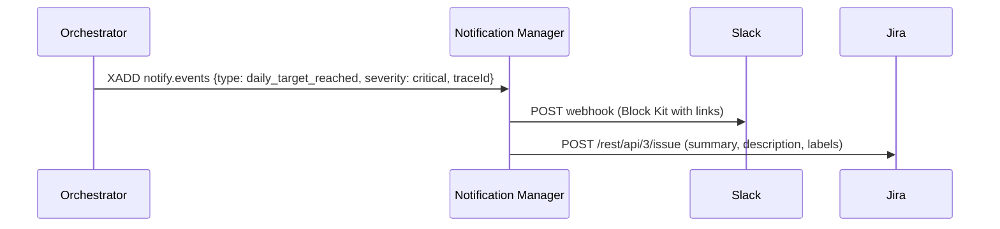
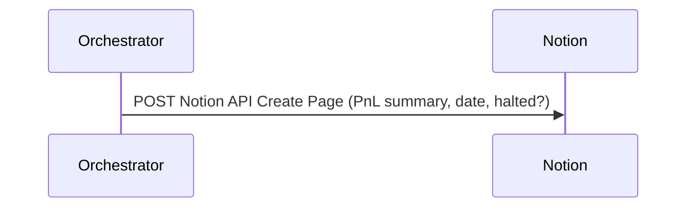

# Integrations Guide (Slack, Jira, Notion)

This guide describes how the trading system integrates with common collaboration and incident tools: Slack (alerts), Jira (automated tickets), and Notion (dashboards/workflows). It includes flows, configuration, security notes, and small code stubs to help you wire these in without invasive changes.

Contents

- Slack (Alerts)
- Jira (Automated tickets)
- Notion (Dashboards / runbooks)
- Security and secrets
- Example flows (Mermaid)
- Compose overrides and env examples

---

## Slack (Alerts)

Status: Implemented.

- Publisher: Notification Manager reads `notify.events` and posts to Slack via webhooks.
- Formatting: Slack Block Kit with severity coloring and quick links to Grafana/Prometheus.
- Severity routing: Can use per-severity webhooks or a single default.

Configuration

- SLACK_WEBHOOK_URL: default webhook (all severities)
- SLACK_WEBHOOK_URL_INFO, SLACK_WEBHOOK_URL_WARNING, SLACK_WEBHOOK_URL_CRITICAL: per-severity overrides
- GRAFANA_URL, PROM_URL: optional links to include in blocks

Admin

- Acknowledge event: POST Notification Manager `/admin/notify/ack` with `X-Admin-Token`.
- Recent feed: GET `/notify/recent` lists recent events and whether they’ve been acked.

See also: `docs/messaging-contracts.md` for notify.events schema and admin endpoints.

---

## Jira (Automated tickets)

Status: Not yet wired; stubs provided below.

Goal

- For critical events (e.g., `type = 'daily_target_reached'` or persistent DLQ growth), automatically open a Jira issue with enough context for triage, and link to dashboards and runbooks.

Recommended mapping

- Project: JIRA_PROJECT_KEY (e.g., OPS)
- Issue type: Bug / Incident / Task (configurable)
- Labels: `system:trader`, `severity:critical`, `trace:<traceId>`
- Fields: Summary, Description (Markdown), Labels; optionally custom fields per org

Environment

- JIRA_BASE_URL=https://your-org.atlassian.net
- JIRA_EMAIL=<jira_user_email>
- JIRA_API_TOKEN or JIRA_API_TOKEN_FILE (Docker secret path)
- JIRA_PROJECT_KEY=OPS
- JIRA_ISSUE_TYPE=Incident (or Task/Bug)

Stub helper (Node)

- File: `common/integrations/jira.js`
- Exports: `createJiraIssue({ summary, description, labels, fields })`
- Usage example (Notification Manager):

````js
import { createJiraIssue } from '../../common/integrations/jira.js';

// inside notify.events consumer when event.severity === 'critical'
await createJiraIssue({
  summary: `[${event.type}] ${event.message || 'Critical event'}`,
  description: `Trace: ${event.traceId || 'n/a'}\n\nContext: ${'```'}${JSON.stringify(event.context || {}, null, 2)}${'```'}`,
  labels: ['system:trader', `type:${event.type || 'event'}`],
});
````

Permissions

- Jira API token must have permission to create issues in the target project.

---

## Notion (Dashboards / runbooks)

Status: Not yet wired; stubs provided below.

Goal

- Maintain a simple operational dashboard or incident log in Notion: a database capturing key events, daily PnL summaries, or DLQ status snapshots.

Recommended mapping

- Database: NOTION_DATABASE_ID
- Properties: Title (summary), Date (ts), Severity, TraceId, RequestId, Context (JSON excerpt)

Environment

- NOTION_API_TOKEN or NOTION_API_TOKEN_FILE (Docker secret path)
- NOTION_DATABASE_ID

Stub helper (Node)

- File: `common/integrations/notion.js`
- Exports: `createOrUpdateNotionPage({ title, properties, content })`
- Usage example (batch job or Notification Manager hook):

````js
import { createOrUpdateNotionPage } from '../../common/integrations/notion.js';

await createOrUpdateNotionPage({
  title: `Event: ${event.type}`,
  properties: {
    Severity: { select: { name: (event.severity || 'info').toUpperCase() } },
    TraceId: { rich_text: [{ text: { content: event.traceId || '' } }] },
    RequestId: { rich_text: [{ text: { content: event.requestId || '' } }] },
  },
  content: `Context: ${'```'}${JSON.stringify(event.context || {}, null, 2)}${'```'}`,
});
````

Permissions

- The Notion integration must be added to the target database and have edit permission.

---

## Security and secrets

- Provide sensitive values via Docker secrets where possible. Use `*_FILE` env variants to read tokens from a mounted file.
- Restrict egress: only Notification Manager (or a dedicated Integrations agent) should be allowed to call SaaS APIs.
- Avoid logging tokens; redact webhook URLs and API tokens from logs.
- Rotate tokens regularly; keep a small rotation calendar and validate access after rotation.

---

## Example flows (Mermaid)

Critical incident → Slack + Jira



Daily summary → Notion dashboard



---

## Compose overrides and env examples

Example docker-compose.override.yml snippet (do not commit real values):

```yaml
services:
  notification-manager:
    environment:
      - SLACK_WEBHOOK_URL_INFO=${SLACK_WEBHOOK_URL_INFO}
      - SLACK_WEBHOOK_URL_WARNING=${SLACK_WEBHOOK_URL_WARNING}
      - SLACK_WEBHOOK_URL_CRITICAL=${SLACK_WEBHOOK_URL_CRITICAL}
      - JIRA_BASE_URL=${JIRA_BASE_URL}
      - JIRA_EMAIL=${JIRA_EMAIL}
      - JIRA_API_TOKEN_FILE=/run/secrets/jira_api_token
      - JIRA_PROJECT_KEY=${JIRA_PROJECT_KEY}
      - JIRA_ISSUE_TYPE=${JIRA_ISSUE_TYPE}
      - NOTION_API_TOKEN_FILE=/run/secrets/notion_api_token
      - NOTION_DATABASE_ID=${NOTION_DATABASE_ID}
    secrets:
      - jira_api_token
      - notion_api_token

secrets:
  jira_api_token:
    file: ./secrets/jira_api_token
  notion_api_token:
    file: ./secrets/notion_api_token
```

Wiring options

- Easiest: Add conditional hooks in Notification Manager to call Jira/Notion for chosen events (critical severity, or DLQ thresholds).
- Alternative: Use the `integrations-broker` agent that subscribes to `notify.events` and handles SaaS integrations, isolating external egress and failures from Notification Manager.

Testing

- Use a test project (Jira) and a test database (Notion) during development.
- Add integration tests that simulate a critical event and assert the HTTP calls (use a mock HTTP server or record requests).
