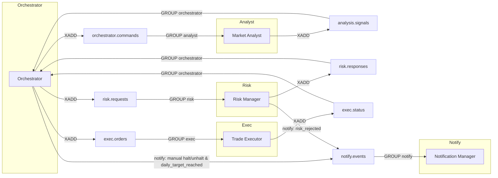

# Messaging Contracts (Redis Streams)

All inter‑agent messaging standardizes on Redis Streams (XADD/XREADGROUP) on the internal `backend` Docker network. Payloads are JSON stored under the `data` field of each stream entry. Every message must include `ts` (ISO 8601). Stable identifiers are required where applicable and are propagated across streams:

- requestId — correlation across analysis → risk → exec
- orderId — execution life cycle (often equals requestId in this scaffold)
- traceId — end‑to‑end tracing across services

Streams and message schemas

- orchestrator.commands
  - analyze: { type: 'analyze', requestId, symbol, traceId, ts }
  - halt: { type: 'halt', reason?, traceId, ts }
- analysis.signals
  - { requestId, symbol, side: 'buy'|'sell', confidence: number, traceId, ts }
- risk.requests
  - { requestId, symbol, side, confidence, traceId, ts }
- risk.responses
  - { requestId, ok: boolean, reason?: string, traceId, ts }
- exec.orders
  - { orderId, symbol, side, qty, traceId, ts }
- exec.status
  - { orderId, status: 'filled'|'rejected'|'failed'|'pending', symbol, side, qty, profit?, traceId, ts }
- notify.events
  - { type, severity: 'info'|'warning'|'critical', message?, context?, requestId?, traceId, ts }

Consumer groups (who reads what)

- analyst → orchestrator.commands
- risk → risk.requests
- exec → exec.orders
- orchestrator → analysis.signals, risk.responses, exec.status
- notify → notify.events

Dataflow (Mermaid)

Notes

- Each primary stream has a DLQ at `<stream>.dlq` when `maxFailures` is exceeded.
- Admin can inspect/requeue via Orchestrator:
  - GET /admin/streams/pending?stream=&group=
  - GET /admin/streams/dlq?stream=
  - POST /admin/streams/dlq/requeue { dlqStream, id }

Idempotency (per consumer)
Consumers compute idempotency keys from stable identifiers and store short‑lived keys in Redis to avoid duplicate processing:

- orchestrator/analysis.signals: key = requestId
- orchestrator/risk.responses: key = requestId
- orchestrator/exec.status: key = orderId
- analyst/orchestrator.commands: key = requestId
- risk/risk.requests: key = requestId
- exec/exec.orders: key = orderId
- notify/notify.events: key = requestId, or fallback `${type}:${traceId}:${ts}`

Dead‑letter queues (DLQ)

- On handler error, failures are retried. After `maxFailures` (default 5), the message is moved to `<stream>.dlq` with payload:
  - { originalStream, group, id, payload, error, ts }
- DLQ streams exist alongside each primary stream:
  - orchestrator.commands.dlq, analysis.signals.dlq, risk.requests.dlq, risk.responses.dlq, exec.orders.dlq, exec.status.dlq, notify.events.dlq

Admin operations (Orchestrator service)

- GET /admin/streams/pending?stream=<stream>&group=<group>
  - Returns Redis XPENDING summary: [count, smallestId, greatestId, [[consumer, count]...]]
- GET /admin/streams/dlq?stream=<dlq>
  - Lists entries (id + parsed payload)
- POST /admin/streams/dlq/requeue { dlqStream, id }
  - Re‑publishes original payload to its `originalStream` and deletes the DLQ entry
    All admin endpoints require header: `X-Admin-Token: <ADMIN_TOKEN>`.

Monitoring

- Prometheus metric `stream_pending_count{stream,group}` gauges pending messages per stream/group (exported by agents using `startPendingMonitor`).

Reliability notes

- Use consumer groups per role; horizontal scale by adding consumers to the same group.
- Use idempotency TTLs to bound duplicate suppression windows (default 24h).
- Prefer one stream per logical topic with a single consumer group per role.

Security

- Redis is internal‑only on the Docker network. If externalizing, require AUTH and TLS and use distinct credentials per environment/service.
