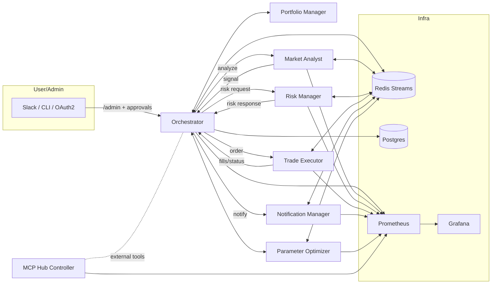

# Modular Multi‑Agent Crypto Trading System — Specification & Setup Guide

This document specifies a modern, modular multi‑agent cryptocurrency trading system and provides a production‑ready setup guide for cloud/server deployment (e.g., Hetzner). It is aligned with the scaffold in this repository and extends it with conventions for extensibility, integration, observability, and security.

Contents

- Architecture overview
- Agent roles and APIs
- Extensibility via configuration (no code changes)
- Integrations: Slack, Jira, Notion
- Messaging contracts (Redis Streams)
- Security model and secrets
- Monitoring & logging (Prometheus/Grafana, Loki/Papertrail)
- Deployment on Hetzner
- Loss‑triggered Parameter Optimizer workflow
- Legacy refactoring guidance
- Documentation, diagrams, quick‑start, and migration notes

## 1) Architecture Overview

- Independent agents (Node 20/Express) run in isolated Docker containers with:
  - `/health` and `/metrics` endpoints
  - OpenAPI specs under `openapi/*.yaml`
  - Redis Streams for inter‑agent messaging with consumer groups, idempotency, and DLQs
  - Prometheus scraping and Grafana dashboards
- Ingress via Traefik (TLS + optional OAuth2 proxy + mTLS for admin)
- Persistence:
  - Redis for streams, idempotency keys, and daily PnL state
  - Postgres for durable audit and PnL day summaries
- CI-friendly: integration tests validate PnL halt, Streams pending, and DLQ requeue.

High‑level dataflow (Mermaid):



## 2) Agent Roles and APIs

All agents expose:

- `GET /health` — liveness and dependency pings
- `GET /metrics` — Prometheus metrics (default metrics + HTTP histograms + stream pending gauges)

OpenAPI specs: see `openapi/*.yaml` for each agent.

1. Orchestrator

- Role: Global coordination; triggers analyses, evaluates risk, submits orders, aggregates PnL, enforces daily profit target/halt, provides admin/ops endpoints and audit.
- Core REST:
  - `POST /orchestrate/run` — Start orchestration for a symbol/session; supports mode: `http|pubsub|hybrid`
  - `POST /orchestrate/stop` — Stop orchestration
  - `GET /pnl/status` — Current daily PnL and halt state
- Admin (secured via OAuth2/mTLS/Admin token):
  - `POST /admin/orchestrate/halt` | `POST /admin/orchestrate/unhalt`
  - `POST /admin/pnl/reset`
  - `GET /admin/streams/pending?stream=&group=`
  - `GET /admin/streams/dlq?stream=`
  - `POST /admin/streams/dlq/requeue` { dlqStream, id }
- Messaging:
  - Publishes `orchestrator.commands` (analyze/halt)
  - Consumes `analysis.signals`, `risk.responses`, `exec.status`
  - Publishes `risk.requests`, `exec.orders`, `notify.events`

2. Market Analyst

- Role: Ingest market data and generate trading signals per strategy.
- REST:
  - `POST /analysis/ingest` — ingest data (stub)
  - `GET /analysis/signal` — last/preview signal (stub)
  - `POST /analysis/analyze` — analyze a symbol and produce signal
- Streams:
  - Consumes `orchestrator.commands` (type=analyze)
  - Publishes `analysis.signals`

3. Portfolio Manager

- Role: Maintain holdings, targets, and rebalancing policies.
- REST:
  - `GET /portfolio/holdings`
  - `POST /portfolio/rebalance`

4. Risk Manager

- Role: Apply risk rules to candidate orders, track limits, enforce circuit breakers.
- REST:
  - `POST /risk/evaluate` — returns ok/reason, riskScore
  - `GET /risk/limits`
- Streams:
  - Consumes `risk.requests`
  - Publishes `risk.responses`
  - Emits notify events for rejects (warning)

5. Trade Executor

- Role: Submit orders to exchanges, track fills/status, emit execution events.
- REST:
  - `POST /trade/submit`
  - `GET /trade/status/{id}`
- Streams:
  - Consumes `exec.orders`
  - Publishes `exec.status` (includes per‑fill profit in scaffold)

6. Notification Manager

- Role: Fan‑out alerts to Slack/webhooks, track acks, DLQ failures, and provide recent events.
- REST:
  - `POST /notify` — enqueue an event
  - `GET /notify/recent` — list recent
  - Admin: `POST /admin/notify/ack` (X‑Admin‑Token)
- Streams:
  - Consumes `notify.events` with idempotency and DLQ

7. Parameter Optimizer (loss‑triggered)

- Role: Aggregate loss periods, run backtests/sweeps, propose new parameters, stage/apply with approvals.
- REST:
  - `POST /optimize/run` — trigger a job
  - `GET /optimize/params` — current recommended parameters
- Streams (recommended):
  - `opt.requests` (from Orchestrator on loss triggers)
  - `opt.results` (with recommendations)

8. MCP Hub Controller

- Role: Coordinate MCP hubs and AI toolchains, status and command fanout.
- REST:
  - `GET /mcp/status`, `POST /mcp/command`

Dockerization

- Each agent ships a Dockerfile (Node 20, non‑root, read‑only FS recommended). Images are built by `docker compose build`. See per‑agent Dockerfiles under `agents/*/Dockerfile`.
- APIs documented in `openapi/*.yaml`. Keep OpenAPI synced with code before release.

Health and metrics

- Health: returns dependency checks (e.g., Redis ping). Include process uptime and ISO timestamp.
- Metrics: default process metrics + HTTP request histograms; Streams expose `stream_pending_count{stream,group}`.

## 3) Extensibility (No Code Changes)

Add strategies, agent types, or data sources via configuration files and environment variables, not code:

Directory layout proposal:

```
config/
  strategies/
    momentum.yaml
    mean_reversion.yaml
  datasources/
    binance_spot.yaml
    coinbase_advanced.yaml
  agents/
    market-analyst.yaml
    portfolio-manager.yaml
    risk-manager.yaml
    trade-executor.yaml
  orchestrator.yaml
```

Schema examples

- `config/strategies/momentum.yaml`

```yaml
name: momentum
enabled: true
symbols: [BTC-USD, ETH-USD]
lookback: 50
entry_threshold: 1.5
exit_threshold: 0.5
risk_profile: conservative
signal_channel: analysis.signals
```

- `config/datasources/binance_spot.yaml`

```yaml
exchange: binance
market: spot
symbols: [BTCUSDT, ETHUSDT]
api:
  key_env: BINANCE_API_KEY
  secret_env: BINANCE_API_SECRET
  passphrase_env: null
rate_limits:
  orders_per_minute: 60
  weight_per_minute: 1200
```

- `config/agents/risk-manager.yaml`

```yaml
limits:
  max_position_usd: 20000
  max_order_usd: 1000
  max_daily_loss_pct: 2
rules:
  - type: min_confidence
    threshold: 0.6
  - type: trading_window
    start: '00:00'
    end: '23:59'
```

- `config/orchestrator.yaml`

```yaml
mode: hybrid # http|pubsub|hybrid
symbols: [BTC-USD]
daily_target_pct: 1
start_equity: 1000
optimizer:
  loss_trigger:
    max_drawdown_pct: 1.0
    consecutive_losers: 3
  approval: manual # manual|auto
```

Conventions

- Agents read their YAML on startup (mount `./config:/config:ro`) and support live reload via SIGHUP or poll (optional future).
- Credentials are provided via env/secret names referenced in config and resolved from Docker secrets at runtime.
- New strategy or data source = add YAML and restart relevant agent(s). No code change required when adhering to existing adapters.
- Unknown fields are ignored to preserve forward compatibility.

## 4) Integrations

Slack (alerts/approvals)

- Notification Manager supports Slack via webhook URLs. Configure per‑severity webhooks or a single webhook with channel overrides.
- For interactive actions and admin controls in Slack, use `slack-mcp-server` calling Orchestrator and Notification Manager admin endpoints with `X-Admin-Token`. See `docs/mcp_tools.md`.
- Example events: risk rejects, halts/unhalts, DLQ notices, optimizer recommendations (with Approve/Reject buttons).

Jira (tickets/tasks)

- Flow: on critical incidents (halt, DLQ growth, order failures), Orchestrator emits `notify.events` with `type=jira_ticket` and context. A Jira Integration worker (can be part of Notification Manager or a separate agent) creates an issue via Jira REST API and posts the link back into Slack.
- Configuration (Docker secrets/env):
  - `JIRA_BASE_URL`, `JIRA_EMAIL`, `JIRA_API_TOKEN` (secret), `JIRA_PROJECT_KEY`, optional `JIRA_ISSUE_TYPE`
- Suggested Streams:
  - `integrations.jira.create` -> worker -> `integrations.jira.created`
- Ticket lifecycle automation: transitions based on `exec.status` failures resolved, or manual ack from Slack MCP.

Notion (dashboards/runbooks)

- Maintain operational dashboards, PnL summaries, and runbooks.
- Configuration: `NOTION_API_KEY` (secret), `NOTION_DB_ID_PNL`, `NOTION_DB_ID_INCIDENTS`.
- Flow: Orchestrator/Notification Manager emit `integrations.notion.upsert` events with page properties; a Notion worker updates pages.

Integration security

- All integration agents/services run on the internal `backend` network with no public ports.
- All tokens are provided as Docker secrets and mounted read‑only.
- Minimal scopes for each integration key; rotate regularly.

## 5) Messaging Contracts (Redis Streams)

Standardize channels and payloads (JSON in `data` field of Redis Stream entries). All messages include `ts` (ISO), and propagate `requestId` and `traceId` where applicable.

Streams (baseline):

- `orchestrator.commands`
  - analyze: `{ type: 'analyze', requestId, symbol, traceId, ts }`
  - halt: `{ type: 'halt', reason?, traceId, ts }`
- `analysis.signals`
  - `{ requestId, symbol, side: 'buy'|'sell', confidence: number, traceId, ts }`
- `risk.requests`
  - `{ requestId, symbol, side, confidence, traceId, ts }`
- `risk.responses`
  - `{ requestId, ok: boolean, reason?: string, traceId, ts }`
- `exec.orders`
  - `{ orderId, symbol, side, qty, traceId, ts }`
- `exec.status`
  - `{ orderId, status: 'filled'|'rejected'|'failed'|'pending', symbol, side, qty, profit?, traceId, ts }`
- `notify.events`
  - `{ type, severity: 'info'|'warning'|'critical', message?, context?, traceId, ts }`
- Optimizer (recommended):
  - `opt.requests` — `{ reason: 'drawdown'|'losing_streak'|..., window: { from, to }, symbols, traceId, ts }`
  - `opt.results` — `{ jobId, recommended: { ...params }, backtest: { winRate, sharpe, maxDD }, approval: 'pending'|'approved'|'rejected', traceId, ts }`

Reliability & DLQ

- Use consumer groups per role: e.g., `analyst`, `risk`, `exec`, `notify`.
- Idempotency keys keyed to stable identifiers: `requestId`, `orderId`, or `traceId`.
- Failures are retried until maxFailures; then payload moves to `<stream>.dlq` with an error record. Admins can requeue via Orchestrator admin endpoints or `scripts/ops_cli.js`.

Security

- Redis is internal only. If externalizing, require TLS and AUTH with unique credentials and ACLs.

See also: `docs/messaging-contracts.md` — Streams channel contracts and schemas (consumer groups, idempotency, DLQ).

## 6) Security Model & Secrets

Principles

- Defense in depth: OAuth2 proxy at ingress + mTLS for admin routes + signed admin token header.
- Least privilege: per‑service credentials, minimal scopes, deny‑by‑default network.
- No secrets in images; provide via Docker secrets or env‑from‑file with restricted permissions.

Secrets via Docker

- This repo uses Docker secrets for: `admin_token`, `postgres_password`, `slack_bot_token`/`slack_signing_secret` (optional), `oauth2_client_id`/`oauth2_client_secret`/`oauth2_cookie_secret`.
- Create files under `./secrets/` and reference in `docker-compose.yml`.
- Agents should read `*_FILE` env variants to load secrets from mounted files (e.g., `POSTGRES_PASSWORD_FILE`).

Best practices

- Non‑root containers, read‑only FS, `cap_drop: [ALL]`, `no-new-privileges: true`.
- Restrict public exposure to Traefik only; keep agent ports internal.
- UFW default deny; allow only 80/443 and SSH from trusted IPs; consider WireGuard VPN for ops.
- Rotate tokens and keys regularly. Maintain a secrets inventory and rotation calendar.
- Avoid logging secrets or PII; scrub logs; encrypt at rest if storing sensitive data.
- mTLS for `/admin/*` per `docs/mtls_runbook.md`. OAuth2 via `oauth2-proxy` with GitHub/Google/Okta.

## 7) Monitoring & Logging

Prometheus & Grafana

- Prometheus scrapes `/metrics` for all agents (see `prometheus/prometheus.yml`).
- Grafana is pre‑provisioned with a base dashboard (see `grafana/dashboards/ops.json`). Extend with:
  - Stream lag/pending per stream/group
  - DLQ counts and requeue rates
  - Business KPIs (PnL percent, fills/hour, rejection rates)
- Add exporters (recommended next):
  - `redis_exporter` and `postgres_exporter` services in Compose

Alerting

- Alertmanager to Slack (configure `ALERT_SLACK_WEBHOOK_URL`, `ALERT_SLACK_CHANNEL`).
- Define SLOs/alerts: service down, error rate > X, stream pending > Y for Z minutes, DLQ growth, DB/Redis down.

Structured logging

- JSON logs with `requestId`/`traceId` correlation (see `common/logger.js` and `common/trace.js`).

Log shipping options

- Loki: add `grafana/loki` + `grafana/promtail` in Compose; configure promtail to tail container logs and label by service.
- Papertrail: use Docker `syslog` log driver with `syslog-address` pointing to Papertrail, or run an agent.

Example: promtail scrape configuration (snippet)

```yaml
scrape_configs:
  - job_name: docker
    static_configs:
      - targets: [localhost]
        labels:
          job: docker
          __path__: /var/lib/docker/containers/*/*-json.log
```

## 8) Deployment (Hetzner or similar)

Prereqs

- Ubuntu 22.04 LTS on x86_64, 2+ vCPU, 4+ GB RAM (bigger for load), 50+ GB SSD
- DNS A/AAAA records to the server IP (for Traefik TLS)

Server bootstrap (as root or sudo)

- Run the included bootstrap to install Docker, harden the host, and prepare directories (review before running):

```
./setup.sh
```

- Create secrets (do not commit):

```
mkdir -p secrets
openssl rand -base64 32 > secrets/oauth2_cookie_secret
printf 'your-admin-token' > secrets/admin_token
printf 'your-postgres-password' > secrets/postgres_password
# Optional Slack MCP
printf 'xoxb-...' > secrets/slack_bot_token
printf 'your-signing-secret' > secrets/slack_signing_secret
# OAuth2 (GitHub/Google/Okta as configured in oauth2-proxy)
printf 'client-id' > secrets/oauth2_client_id
printf 'client-secret' > secrets/oauth2_client_secret
```

Environment & compose

- Copy `.env.example` to `.env` and fill values (domains, emails for Let’s Encrypt, Redis/Postgres settings).
- Review `docker-compose.yml`. Optional: add `docker-compose.override.yml` for mTLS CA mount as per `docs/mtls_runbook.md`.
- Build and start:

```
docker compose build
docker compose up -d
```

Verification

- Check `/health` and `/metrics` on each agent via internal URLs or via Traefik routes.
- Access Grafana and Prometheus (protect with OAuth/IP allowlists in production).
- Run tests:

```
docker compose run --rm tests
```

Ops CLI examples

```
node scripts/ops_cli.js streams:pending --stream notify.events --group notify
node scripts/ops_cli.js streams:dlq:list --stream notify.events.dlq
node scripts/ops_cli.js streams:dlq:requeue --stream notify.events.dlq --id <id>
node scripts/ops_cli.js orch:halt --reason maintenance
node scripts/ops_cli.js notify:ack --traceId <id>
```

## 9) Loss‑Triggered Parameter Optimizer

Objective

- When performance degrades (drawdown or losing streak), automatically analyze historical data, run backtests across parameter grids, and produce recommended parameters for strategies. Apply automatically or after approval.

Triggers

- From Orchestrator daily PnL or rolling window metrics:
  - `percent <= -max_drawdown_pct`
  - `consecutive_losers >= N`
  - `Sharpe < threshold` over window (optional)

Workflow

1. Orchestrator publishes `opt.requests` with context (symbols, window, reason).
2. Optimizer aggregates logs/metrics and fetches historical candles/trades from configured data sources.
3. Run grid/random/bayesian search over strategy parameter spaces defined in `config/strategies/*.yaml`.
4. Produce `opt.results` with:
   - `recommended` parameter set
   - backtest report (winRate, PF, Sharpe, maxDD, expected slippage/fees)
   - `approval: pending`
5. Notification Manager posts Slack message with summary and Approve/Reject buttons (via Slack MCP or webhook actions).
6. On approval:
   - Optimizer writes `config/strategies/<name>.yaml` update to a mounted `config/` volume (or a `params` KV in Redis/DB), and emits `notify.events`.
   - Orchestrator (and Market Analyst/Risk Manager if relevant) hot‑reload or restart to apply parameters.
7. Audit: insert events into Postgres `audit_events`; persist PnL day into `pnl_days`.

Controls & safety

- Manual gate (default); auto‑apply allowed only for low‑risk changes.
- Rollback: store previous parameter versions; ability to revert via admin endpoint.
- Rate limit optimizations; avoid thrashing.

## 10) Legacy Refactoring Guidance

Replace monolithic/legacy patterns (e.g., from older CLAUDE.md / CCTRADE 2‑style designs):

- Direct, synchronous, cross‑module calls -> Replace with Redis Streams + consumer groups for decoupling and backpressure.
- Single DB‑centric god service -> Separate concerns: analysis, risk, execution, notification, optimization.
- Inline secrets and global config constants -> Externalize to Docker secrets and `config/*.yaml`.
- Shared mutable state in memory -> Move to Redis/DB; prefer idempotent handlers and stateless services.
- Ad‑hoc logging -> Use structured JSON with trace IDs; centralize shipping to Loki/Papertrail.
- No health/metrics -> Standardize `/health` and `/metrics` endpoints and export process metrics.
- Single process error handling -> Introduce DLQs and requeue tooling; admin endpoints for stream ops.
- Weak access control -> Add OAuth2 (oauth2‑proxy), mTLS on admin, rate limiting, and IP allowlists.

Why

- Improves reliability, debuggability, and scale; reduces coupling; enables safer evolution and faster incident response.

## 11) Documentation, Diagrams, Quick‑Start, Migration

Diagrams

- Maintain architecture and dataflow diagrams (Mermaid in repo or exported PNGs). Keep them updated with major changes.

Migration notes (legacy -> agents)

- Identify legacy responsibilities and map to agents:
  - Strategy logic -> Market Analyst + Parameter Optimizer
  - Order routing -> Trade Executor
  - Limits and safeguards -> Risk Manager
  - Coordination and PnL -> Orchestrator
  - Alerts & incidents -> Notification Manager
- Migrate config to `config/*.yaml`; provide mapping tables in a dedicated migration doc if needed.

Quick‑start (local/dev)

```
npm ci
docker compose build
docker compose up -d
docker compose run --rm tests
```

CLI & monitoring examples

- See `scripts/ops_cli.js` and Grafana dashboard `grafana/dashboards/ops.json`.
- Use `/admin/streams/*` endpoints to inspect/requeue DLQ.

OpenAPI & contracts

- Keep `openapi/*.yaml` authoritative for HTTP; keep this spec + `docs/messaging-contracts.md` authoritative for Streams.

Change management

- Before releases: update OpenAPI, run tests, export SBOM, scan images (Trivy), tag and push images.

---

Appendix: Pointers

- README.md — repository overview and production checklist
- docs/mcp_tools.md — Slack MCP admin tools
- docs/messaging-contracts.md — Streams channel contracts and schemas (consumer groups, idempotency, DLQ)
- docs/mtls_runbook.md — mutual TLS for admin routes
- docker-compose.yml — services, networks, secrets, monitoring stack
- prometheus/, grafana/ — observability stack provisioning
- scripts/ops_cli.js — admin CLI for streams and notifications
- tests/integration/ — CI tests for PnL, Streams, and DLQ
